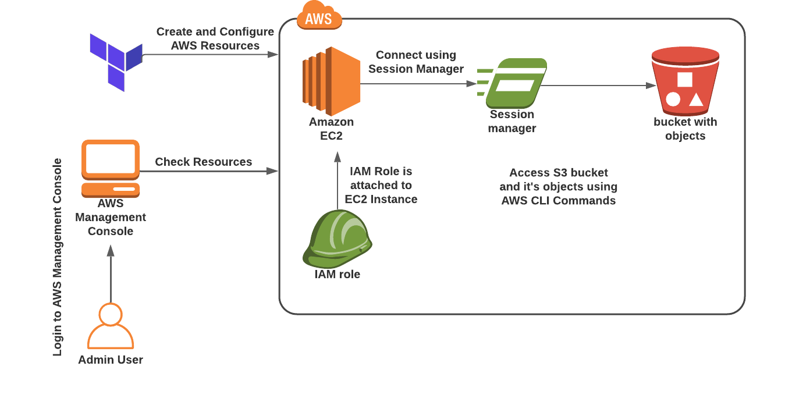

## Detalles del desafio

Este laboratorio te guiará a través de los pasos para acceder al bucket S3 y sus objetos desde una instancia EC2 utilizando un Rol IAM.

- **Región de AWS:** US East (N. Virginia) us-east-1.

### Prerrequisitos

- Instala Terraform en tu máquina local siguiendo esta [guía oficial de HashiCorp](https://learn.hashicorp.com/tutorials/terraform/install-cli).
- Descarga e instala el editor Visual Studio Code utilizando esta [guía](https://code.visualstudio.com/download).

### Detalles de la Tarea

1. Inicia sesión en la Consola de Administración de AWS.
2. Configura Visual Studio Code.
3. Crea un archivo de variables.
4. Crea un Bucket S3 y sus componentes en el archivo main.tf.
5. Confirma la instalación de Terraform verificando la versión.
6. Aplica la configuración de Terraform.
7. Verifica los recursos en la Consola de AWS.
8. Valida el laboratorio.
9. Elimina los recursos.

